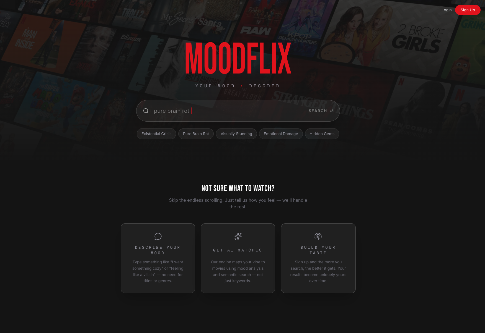

# MoodFlix

A mood-first movie and TV discovery platform powered by semantic AI search and personalized taste vectors.

Instead of browsing genres or scrolling catalogs, describe how you feel - _"something dark and cerebral like a neon-lit fever dream"_ - and MoodFlix finds what matches.

**Live Demo:** [moodflix.engineer24.dev](https://moodflix.engineer24.dev/)

> [!NOTE]
> This project was developed using an **AI-augmented workflow**, leveraging LLMs to reason about architecture, validate system design ideas, and refine documentation. The code was written with AI-assisted suggestions but fully reviewed, validated, and owned by the developer.

## What Makes This Different

Traditional recommendation engines rely on watch history and collaborative filtering. MoodFlix takes a fundamentally different approach - it understands _mood_.

- **Mood-based search** - Natural language queries classified by intent (semantic vs factual), with mood extraction across 12 emotional dimensions
- **Taste vectors** - 384-dim user profile built from a mood quiz at onboarding, used to personalize every search and recommendation
- **Zero-LLM recommendations** - Dashboard rows use pure vector similarity and metadata filtering against ChromaDB. LLMs are only involved during search filter construction, keeping recommendation latency low and cost at zero
- **Lumi** - An AI character that highlights its top pick with a written explanation after every search

## Features

### Semantic Search

Describe a vibe and get results that _feel_ right. The search pipeline classifies intent, extracts mood across 12 dimensions, builds metadata filters when needed, and falls back through multiple strategies to always return relevant results. Authenticated users get results personalized by blending their taste vector with the query embedding.

### Personalized Dashboard

Four discovery rows generated from your taste vector:

- **Your Vibe Tonight** - Direct taste vector similarity
- **Hidden Gems For You** - Taste vector + low popularity filter
- **Something Different** - Blind-spot mood detection (finds moods you never explore)
- **Trending Now** - High popularity + recent releases

Cross-row deduplication ensures every title is unique across all rows.

### Onboarding

A 4-step mood quiz (mood, company, commitment, tired-of) generates a 384-dim seed taste vector via weighted embedding averaging. This vector shapes every interaction from the first search onward.

### Guest Experience

10 free searches with progressive signup nudges. Enough to demonstrate value before asking for commitment.

## Architecture

| Service          | Tech                                 | Role                                                              |
| ---------------- | ------------------------------------ | ----------------------------------------------------------------- |
| **Frontend**     | Next.js 16, React 19, Tailwind CSS 4 | UI with BFF pattern - JWT never touches browser JS                |
| **Gateway**      | Java 21, Spring Boot 4, WebFlux      | Auth, JWT validation, 5-filter chain, taste vector injection      |
| **AI Engine**    | Python 3.13, FastAPI, ChromaDB       | Semantic search, mood extraction, personalized recommendations    |
| **ETL Pipeline** | Python 3.13, threaded workers        | TMDB ingestion, LLM enrichment, dual-write to Postgres + ChromaDB |

Supporting infrastructure: PostgreSQL (with pgvector), Redis, Ollama (local LLM), ChromaDB.

## Engineering Highlights

**Gateway filter chain** - 5 ordered reactive filters (sanitization, correlation ID, JWT auth, risk scoring, vector injection) process every proxied request. Local controllers bypass the chain and validate JWTs directly. Built on Project Reactor with fully non-blocking I/O.

**Search pipeline** - Intent classification (regex fast path with zero-shot ML fallback), mood extraction via cosine similarity against 12 mood embeddings, LLM-powered filter building, and a multi-stage fallback chain ensuring results are always returned.

**Taste vector system** - 384-dim vectors (all-MiniLM-L6-v2) generated at onboarding, stored in PostgreSQL (pgvector), cached in Redis, and injected via gateway header on every authenticated request. Search results blend 70% query embedding with 30% taste vector.

**ETL consistency model** - Producer-consumer pipeline with Redis buffering. PostgreSQL is the source of truth - if a ChromaDB write fails, the transaction rolls back to maintain the invariant: if it exists in ChromaDB, it must exist in PostgreSQL.

**BFF security pattern** - JWT stored in httpOnly cookie, all API calls route through Next.js server-side routes. Browser JavaScript never sees the token.
